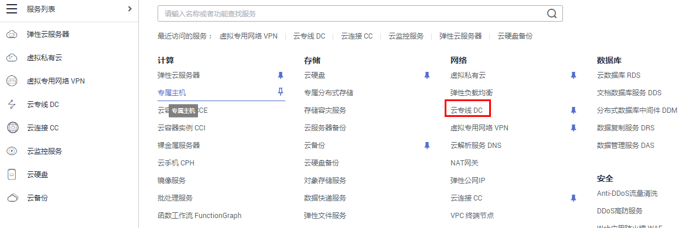
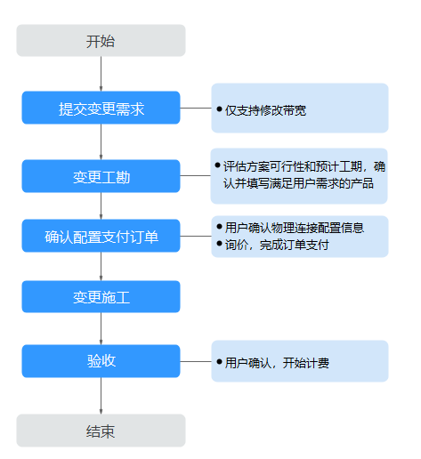

# 修改物理连接

## 修改自购线路物理连接

**操作场景**

用户开通物理连接后，可以修改已开通的物理连接名称和描述信息。

**操作步骤**

1.  登录管理控制台。
2.  在系统首页，单击管理控制台左上角的，选择区域和项目。
3.  在系统首页，单击管理控制台左上角的，选择“网络 \> 云专线”。

    

4.  在左侧导航栏，选择“云专线 \> 物理连接”。

    

5.  在物理连接列表中，单击物理连接操作列中“修改”，根据界面提示，修改对应的物理连接名称和描述。

    

6.  修改完成后单击“确定”，完成物理连接的修改。

    

## 修改一站式接入物理连接

**操作场景**

用户开通一站式接入物理连接后，可以修改已开通物理连接的带宽。

**操作流程**

**操作步骤**

1.  提交需求信息。
    1.  登录控制台，选择并进入云专线服务。
    2.  在物理连接列表中，单击目标物理连接操作列中的“变更规格”。
    3.  根据需要选择带宽信息。

        > **说明：** 
        >物理连接当前不支持降配。

    4.  单击“提交需求”。

2.  变更工勘。

    华为云评估该变更需求的可行性以及预计工期，和用户确认满足需求后，回填对应产品信息后将订单返回给用户。

3.  确认配置支付订单。
    1.  在物理连接页面，单击目标物理连接操作列的“确认配置”。
    2.  在确认配置页面，确认物理连接变更信息，单击“立即支付”。

        > **说明：** 
        >用户在支付前须阅读并接受《一站式接入服务声明》，并在确认配置页面中勾选。

4.  变更施工。

    变更施工预计需要20个工作日，变更上线时物理连接可能会中断，需要用户确认变更上线的时间窗口。

5.  确认。

    在物理连接页面，单击目标物理连接操作列的“确认施工完成”。

